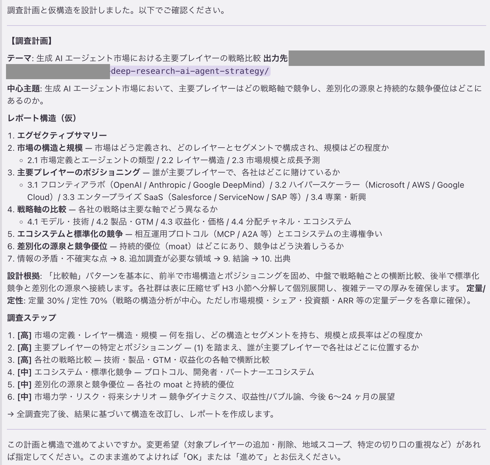

# Deep Research Agent Skill

AI Agent 用の **Deep Research（ディープリサーチ）スキル** です。リサーチテーマの調査計画に基づいてレポート構造（章立て・分析要素・定量/定性比率）を動的に設計し、反復的な Web 調査の結果を踏まえて構造を改訂してから、構造化された調査レポートを生成します。

以下の環境で動作を確認しています

- Claude Opus 4.7/4.8, Sonnet 5
- Kiro CLI
- Kiro IDE
- Claude Code

## サンプルレポート

本スキルが実際に生成したレポートです。

| # | 入力プロンプト | 構造タイプ | モデル | レポート |
|---|---|---|---|---|
| 1 | `Loop Engineeringについてディープリサーチ` | 概念解説型 | Claude Opus 4.8 | [Loop Engineering: 「ループを設計する」パラダイム](./sample_report/loop_engieering.md) |
| 2 | `生成AIの電力需要がデータセンター立地と電力網に与える影響を、シナリオ別に徹底調査して` | シナリオ分析型 | Claude Opus 4.8 | [生成AIの電力需要とデータセンター・電力網への影響](./sample_report/genai_power_grid.md) |
| 3 | `2024年以降のグローバルな半導体サプライチェーン再編を、その要因と波及効果までディープリサーチして` | 因果・時系列型 | Claude Sonnet 5 | [グローバル半導体サプライチェーン再編: 要因と波及効果](./sample_report/semiconductor-supplay-chain.md) |

## 利用にあたってのポイント

- 10-30分程度時間がかかります
- Token 消費量にご注意ください
- 標準のWeb検索を利用します。tavily、brave がある環境ではそちらも使います。

## 特徴

- **動的な構造設計**: テーマの性質に応じて章立てを毎回設計します。
- **2 段階構造設計**: 調査前に仮構造を設計し、全調査の完了後に調査内容に応じて、より適切な内容に改訂します。
- **一次情報優先**: 公式発表・原典・当事者発信などの一次情報を優先的に探索し、Web 検索で裏付けを取ります。
- **源泉の検証**: 記事数の多さを確からしさと混同せず、源泉まで畳んだ独立ソース数で確信度を判定します。
- **主張タイプ別の確信度基準**: 事実抽出系・集合知系・解釈系で確信度の判定基準を切り替え、過剰な留保を避けます。
- **展開深度の制御**: 分量ではなく展開深度（事実 → 因果 → 波及 → 含意）でレポートの厚みを制御します。柱となる発見を含意まで掘り下げ、事実の列挙や表の投げ放しで止めません。複雑テーマでは主要章を小節に分解し、深さ・粒度をテーマの複雑度に比例させます。
- **文体統制**: 調査会社レポート / アナリストレポートの文体を基準とし、エッセイ調や文学的比喩を排除しています。
- **4 段階の最終検証**: 文体・引用書式・チェックポイント突合・情報の源泉 の 4 つの検証を実施します。

## 動作を詳しく知る

テーマを受け取ってから最終レポートを出力するまでの流れ（5 フェーズ、調査ループ、provenance の判定など）は、動作解説ドキュメントにまとめています。

[`how-it-works.md`](./docs/how-it-works.md)


## 構成要素

### Deep Research スキル（`deep-research-skills/`）

調査の実行ロジックを定義するスキル本体です。`SKILL.md` がエントリポイントとなり、`references/` 配下の詳細ドキュメントを参照しながら調査を進めます。

| ファイル | 役割 |
|---|---|
| `SKILL.md` | スキルの起動宣言、役割、思考ロジック、絶対ルール、参照マップ |
| `references/workflow.md` | フェーズ 1〜5（調査計画 → 反復調査 → 構造改訂 → レポート作成 → 最終突合）の手順 |
| `references/structure-design-guide.md` | 章立て・章間接続・分析要素・定量/定性比率の設計原則 |
| `references/common-skeleton.md` | エグゼクティブサマリー・結論・出典など必須要素の定義 |
| `references/citation-format.md` | 脚注記法 `[^N]` と確信度タグの書式 |
| `references/tone-rules.md` | 中立的な調査レポート文体の定義と、回避すべき 7 つの文の機能 |
| `references/conclusion-guide.md` | 結論セクションの 5 要素と書き方 |
| `references/output-calibration.md` | 展開深度の 4 層（事実→因果→波及→含意）と打ち切り禁止・構造粒度・複雑度比例・論証の厳密さの基準 |
| `references/verification.md` | 最終突合の 4 検証手順 |


## 使い方

### トリガーキーワード

以下のような表現でスキルが起動します。

- **日本語**: 深く調べて、徹底調査、ディープリサーチ、アダプティブリサーチ、包括的に調査、詳しく調べて、構造から設計して調べて、テーマに合わせて深く調べて
- **英語**: deep research, adaptive research, thorough investigation, comprehensive research, in-depth analysis, deep dive, design the structure and research

### 入力例


### 実行の流れ（概要）

1. 出力先フォルダ `{YYYYMMDD-HHmm}-deep-research-{テーマの短縮名}/` を作成します。
2. テーマを分析し、3〜7 個の調査ステップに分解します。
3. 調査計画と仮構造をセットで提示し、**[承認を求めてきます]**。
4. 承認後、レポート構造設計し `structure.md` を作成します。
5. 反復的に Web 調査を実行し `checkpoint.md` に記録します。
6. 全調査の完了後、結果に基づいて構造を `structure.md` を Update します。
7. Update したん内容を元に `report.md` を作成し、検証を実施します。


[4]以降の処理には時間がかかります。途中でコマンドの承認を求められることも多いので、Deep Research用のWorkspaceを用意した上で、各AI Agentの自動承認のオプションを有効にして実行するのが良いかもです。


例：調査プラン



## ワークフロー（フェーズ 1〜5）

| フェーズ | 内容 |
|---|---|
| **1. 調査計画と仮構造の設計** | テーマ分析、調査ステップへの分解、仮構造の設計、ユーザー承認 |
| **2. 反復的調査** | 一次情報の探索 → 二次情報の補完 → 深掘り分析 → 飽和判定 → チェックポイント記録 |
| **3. 構造の改訂** | チェックポイントの読み直し、仮構造の改訂（1 回のみ）、統合分析 |
| **4. レポート作成** | 改訂構造に従った `report.md` の出力 |
| **5. 最終突合** | 文体検証・引用書式検証・チェックポイント突合・provenance 検証 |


## 成果物

調査開始時に作成されるフォルダに、以下が格納されます。

```
{YYYYMMDD-HHmm}-deep-research-{テーマの短縮名}/
├── checkpoint.md      # 各ステップの調査結果を蓄積
├── structure.md       # 設計したレポート構造（仮設計 → 改訂の履歴）
├── report.md          # 最終レポート
└── verification.md    # 最終突合の結果
```

## レポートの共通骨格

動的に構造を設計する場合でも、以下の要素は必ず含まれます。

```
**作成日**: YYYY-MM-DD JST
## エグゼクティブサマリー
  （本体セクション群 ← 動的に設計）
## 情報の矛盾・不確実な点
## 追加調査が必要な領域
## 結論
## 出典
```

## ライセンス

本リポジトリは [MIT License](LICENSE) の下で公開しています。著作権表示を残せば、商用利用を含め自由に利用・改変・再配布いただけます。詳細は [`LICENSE`](LICENSE) を参照してください。

## 作者

[h-daimatsu](https://github.com/h-daimatsu)
