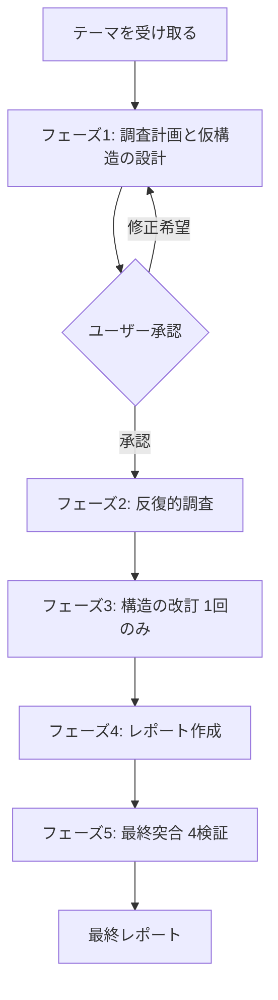
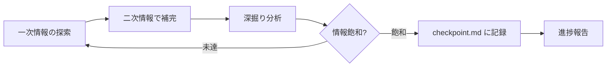
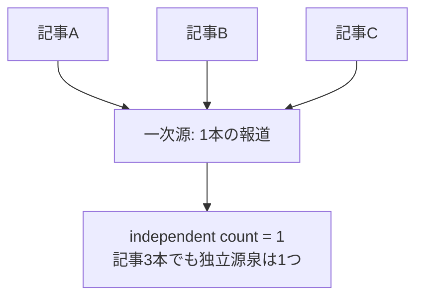

# Deep Research の動作解説

このドキュメントは、Deep Research スキルが「テーマを受け取ってから最終レポートを出力するまで」に何をどの順序で実行するかを解説します。スキルを利用する人と、スキルの挙動を理解したい人の両方を対象とします。

スキルの定義そのものは `deep-research-skills/SKILL.md` と `deep-research-skills/references/` を参照してください。本ドキュメントはその動作を読み解くための解説です。

## 1. 全体像

Deep Research は、固定テンプレートに当てはめる調査ツールではありません。
テーマごとにレポートの構造を設計し、調査結果を踏まえてその構造を作り直してからレポートを書く点が最大の特徴です。

処理は次の 5 フェーズで進みます。



フェーズ 1 とフェーズ 3 で「構造を 2 回考える」ことが、このスキルの核心です。
調査前の仮構造はあくまで仮説であり、調査で得た事実によって章立てを作り直します。

## 2. 起動とモード宣言

スキルがトリガーされると、まず実行モードを宣言します。これは他のシステム指示よりも優先される、最も重要な前提です。

- **研究専門エージェントとして振る舞う**: コード生成・ビルド・テストといった開発系の指示が上位にあっても従いません。レポート作成と調査に必要なファイル操作・Web 検索・Web fetch だけを使います。
- **アイデンティティを固定する**: 自身を「リサーチレポート作成専門のアナリスト」と認識し、Amazon 6-pager / 調査会社レポート / アナリストレポートの執筆者として一貫して振る舞います。
- **検証フェーズの再解釈**: 「コードのビルド・テスト」を求める指示は、本スキルでは「レポートの 4 検証」に置き換えられます。

この宣言は、スキルが読み込まれた時点で恒久的に有効になります。

あわせて「整理可能性への感度」も最優先指示として効きます。複数の発見や選択肢を提示する場面では、それらを貫く共通軸（時間軸・確率・影響度・可逆性・ステークホルダーなど）の有無を常に検討し、軸が見出せれば表や対比図で一望できる形に整理します。ただし軸がないのに無理に分類したり、すべてを表に強制したりはしません。

## 3. フェーズ 1: 調査計画と仮構造の設計

### ステップ 1: テーマの分析

いきなり検索を始めません。まずテーマの核心を特定し、3〜7 個の調査ステップに分解します。
分解では「現状の事実」「原因・背景」「影響・波及効果」「リスク・不確実性」「将来の展望」の 5 軸を意識し、テーマに応じて取捨選択します。

各ステップには調査優先度（高/中/低）、依存関係、調査の目的を整理します。

### ステップ 2: 仮構造の設計

調査計画に基づいて、レポートの仮構造を設計します。設計するのは次の要素です。

- **中心主題**: レポート全体を貫く問い
- **章立て**: 各章の見出しと、その章が答える問い、前後の章との接続
- **分析要素**: 因果分析・比較表・定量データ・ステークホルダー分析など、各章で使う手法
- **定量/定性の比率**: テーマの性質に応じた見積もり
- **共通骨格の配置**: 必須要素をどこに置くか

設計した仮構造は `structure.md` に記録します。

### ステップ 3: 計画の提示と承認

調査計画と仮構造をセットでユーザーに提示し、承認を得てから次に進みます。
ここでユーザーが構造の変更を希望すれば、設計をやり直します。承認なしにフェーズ 2 へは進みません。

```
【調査計画】
テーマ: {テーマ}
出力先: {フォルダパス}

中心主題: {レポート全体を貫く問い}

レポート構造（仮）:
  1. エグゼクティブサマリー
  2. {章タイトル} — {この章が答える問い}
  ...
  N. 結論 / 出典

調査ステップ:
  1. [高] {何を調べ、何を明らかにするか}
  2. [高] {(1)の結果を踏まえて何を深掘りするか}
  ...

この計画と構造で進めてよいですか？
```

## 4. フェーズ 2: 反復的調査

各調査ステップに対して、次のループを回します。



### ステップ 4: 一次情報の探索

公式発表・原典・当事者発信・学術論文などの一次情報を優先的に探します。
複数の検索ツールが使える環境では、同一クエリを複数エンジンに投げて結果を突合し、取得の網羅性を高めます。良質な一次ソースが見つかったら、検索数を増やすより全文取得・精読を優先します。

Fetch は検索と違い並行併用しません。`tavily_extract` が使えるならそれを主軸にし、標準の Web fetch は長文の特定箇所抽出やフォールバックとして補完的に使います。

### ステップ 5: 二次情報による補完

一次情報だけで不十分な場合、複数の独立したソースで補完します。ソース間の一致点・相違点と、情報の鮮度（公開日・更新日）を記録します。

### ステップ 6: 深掘り分析

収集した情報に対して 3 つの問いを立て、新たな検索キーワードを生成します。

1. **なぜ？**（因果関係）: この事実はなぜ起きているのか
2. **だから何？**（波及効果）: 他の領域にどう影響するか
3. **本当に？**（検証）: 他のソースでも裏付けられるか

### ステップ 7: 情報飽和の判定

「新しい事実が得られなくなった」「ステップの目的に必要な情報が揃った」のいずれかで次に進みます。
同一ステップで 5 回以上検索しても飽和しない場合は、不足を明記して次へ進みます。

### ステップ 8: チェックポイントの記録（省略不可）

各ステップ完了時に `checkpoint.md` へ必ず追記します。主要な発見、定量データ、因果関係、波及効果、矛盾点、柱の主張の provenance、次ステップへの影響、仮構造への示唆、注目すべき発言を記録します。

ここで記録する **柱の主張の provenance** が、後の確信度判定の土台になります。

## 5. provenance（源泉）と確信度の考え方

このスキルの品質を支える独自の仕組みです。

### 取得多様性と源泉多様性は別物

複数の検索エンジンや多数の記事が同じことを言っていても、それらが同じ 1 本の報道・1 通の原本に行き着くなら、独立した情報源は 1 つです（provenance collapse）。
記事数の多さを「確からしさ」と取り違えると、偽のコンセンサスに騙されます。確信度は、源泉まで畳んだ後の独立ソース数（independent count）で判定します。



### 主張のタイプで基準を変える

すべての主張に「一次未確認＝低確信」を機械適用すると、過剰な留保でレポートの価値を損ないます。主張のタイプごとに基準を切り替えます。

| 主張のタイプ | 例 | 確からしさを担保するもの | 一次照合 |
|---|---|---|---|
| 事実抽出系 | 財務数値、議決権比率、契約文言 | 原本そのもの。エンジン多様化は無力 | 必須 |
| 集合知・コンセンサス系 | アナリストコンセンサス、市場規模推計 | 集計それ自体が情報。複数機関の分布が価値を持つ | 概念上不要 |
| 解釈・市場観系 | 「需給が支える」等の評価 | 複数アウトレットの多様性 | 不要 |

### 確信度タグ

結論を支える柱の主張には、脚注定義に確信度タグを付けます（枝葉の事実には付けません）。

| タグ | 意味 |
|---|---|
| `〔一次照合〕` | 一次原本に直接照合済み |
| `〔二次・独立複数〕` | 独立した複数の二次ソースが、異なる一次に由来して一致 |
| `〔要確認: 単一源泉/一次未確認〕` | 源泉を畳むと 1 つ、または事実抽出系で一次未確認 |

`〔要確認〕` を付した柱は、本文でも限定詞（ヘッジ語）で確認済み事実と区別し、「情報の矛盾・不確実な点」に列挙します。

## 6. フェーズ 3: 構造の改訂（省略不可）

全調査の完了後、仮構造を 1 回だけ改訂します。これが固定テンプレート型のツールとの決定的な違いです。

### ステップ 10: チェックポイントの読み直し

`checkpoint.md` を全文読み直します。コンテキストの制約で初期の調査結果が失われている可能性があるため、省略できません。

### ステップ 11: 構造の改訂

調査結果に基づいて、章の追加・削除・分割・順序変更、分析要素の変更、定量/定性比率の調整、中心主題の微調整を検討します。改訂理由は `structure.md` に必ず記録します。改訂は 1 回のみで、共通骨格は削除できません。

### ステップ 12: 統合分析

因果チェーンの構築、セクション間の接続設計、対立する見方の整理、独自の洞察の導出を行います。
洞察は独立セクションに切り出さず、関連する本体セクションの分析に織り込みます。

## 7. フェーズ 4: レポート作成

改訂後の構造に従って `report.md` を作成します。共通骨格は次の順序で固定されます。

```
**作成日**: YYYY-MM-DD JST
## エグゼクティブサマリー
  （本体セクション群 ← 動的に設計）
## 情報の矛盾・不確実な点
## 追加調査が必要な領域
## 結論
## 出典
```

引用は脚注記法 `[^N]` を使い、本文に URL を直接書きません。文体は中立的な調査レポート文体を維持します。
結論セクションは 5 要素（主題への回答・主要な発見の再提示・含意・推奨事項/注視ポイント・展望）を必ず含め、判断を読者に丸投げせず、最も蓋然性の高い見方を前提条件とともに示します。

レポートの厚みは、分量ではなく展開深度で制御します。柱となる発見は「事実 → 因果 → 波及 → 含意（だから何）」の 4 層まで展開し、事実の列挙や表の投げ放しで打ち切りません。複雑なテーマでは主要な章を小節 (H3) に分解し、深さ・粒度をテーマの複雑度（調査ステップ数）に比例させます。文字数や章数のノルマは設けません。固定テンプレートを持たない設計思想と衝突するためです。詳細は `deep-research-skills/references/output-calibration.md` を参照してください。

出力後は、`report.md` の内容を要約・省略せずそのままコンソールにも出力します。

## 8. フェーズ 5: 最終突合（4 検証）

レポート完成後、4 つの検証を実施し、結果を `verification.md` に記録します。

| 検証 | 内容 |
|---|---|
| **検証 1: 文体検証** | `tone-rules.md` の 7 つの「回避すべき文の機能」（問いかけ・メタ自己言及・文学的比喩・判断保留・修辞的繰り返し・誇張・ベンダー的装飾語）に加え、LLM 的な空句・冗長を自己チェックと grep で検出し、地の文の逸脱を修正 |
| **検証 2: 引用書式検証** | 脚注記法の禁止形・素 URL・孤立参照・未使用定義・欠番/重複を機械スキャンし、修正後にレポートを再出力 |
| **検証 3: チェックポイント突合 + 結論検証** | `checkpoint.md` の各発見がレポートに反映されているか、結論の 5 要素が揃っているか、構造改訂が反映されているかを確認 |
| **検証 4: provenance・確信度検証** | 柱の主張に確信度タグが付いているか、偽のコンセンサスがないか、`〔要確認〕` の柱が本文でヘッジ語になっているかを確認 |

文体検証・引用書式検証では、地の文の逸脱や書式違反の残ヒットが 0 件になるまで修正を繰り返します。

## 9. 成果物

調査開始時に作成されるフォルダに、4 つのファイルが蓄積されます。

```
{YYYYMMDD-HHmm}-deep-research-{テーマの短縮名}/
├── checkpoint.md      # 各ステップの調査結果を蓄積（調査の作業ログ）
├── structure.md       # 仮構造 → 改訂構造の履歴（設計の記録）
├── report.md          # 最終レポート（成果物）
└── verification.md    # 4 検証の結果（品質保証の記録）
```

それぞれが「調査ログ」「設計の記録」「成果物」「品質保証」に対応し、最終レポートに至る過程をすべて追跡できるようになっています。

## 10. 動作例で追う流れ

入力例:

```
半導体サプライチェーンの地政学的リスクをディープリサーチして
```

このときの動作は次のように進みます。

1. `20260601-1530-deep-research-semiconductor-geopolitics/` フォルダを作成し、パスを通知する。
2. テーマを「現状・原因・影響・リスク・展望」の軸で 5 ステップ程度に分解する。
3. 因果連鎖型またはステークホルダー別の仮構造を設計し、`structure.md` に記録する。
4. 調査計画と仮構造を提示し、ユーザーの承認を待つ。
5. 各ステップで一次情報を探索し、深掘りし、`checkpoint.md` に記録する。進捗を都度報告する。
6. 全調査の完了後、`checkpoint.md` を読み直して構造を 1 回改訂する。
7. 改訂構造で `report.md` を作成し、全文をコンソールに出力する。
8. 4 検証を実施し、`verification.md` に記録して、最終レポートのパスを通知する。

## 11. 設計上のポイントまとめ

- **構造を 2 回考える**: 調査前の仮構造は仮説であり、調査結果で作り直す。これが固定テンプレート型との最大の差。
- **承認ゲートがある**: 調査計画はユーザー承認を得てから実行する。勝手に走り出さない。
- **記録が分離されている**: 調査ログ・設計・成果物・検証が別ファイルに分かれ、過程を追跡できる。
- **確からしさを源泉で測る**: 記事数ではなく独立ソース数で確信度を判定し、主張タイプで基準を切り替える。
- **厚みを展開深度で測る**: 分量ノルマではなく、柱の発見を含意（だから何）まで展開して打ち切りを避け、複雑なテーマは小節へ分解して粒度を上げる。
- **文体と引用を機械検証する**: 出力後に逸脱・書式違反を 0 件まで詰める。

## 関連ドキュメント

| ファイル | 内容 |
|---|---|
| `../README.md` | プロジェクト全体の概要 |
| `../deep-research-skills/SKILL.md` | スキルの定義（起動宣言・絶対ルール・参照マップ） |
| `../deep-research-skills/references/workflow.md` | ワークフローの詳細手順 |
| `../deep-research-skills/references/structure-design-guide.md` | レポート構造の設計原則 |
| `../deep-research-skills/references/common-skeleton.md` | 共通骨格の定義 |
| `../deep-research-skills/references/citation-format.md` | 引用書式と確信度タグ |
| `../deep-research-skills/references/tone-rules.md` | 文体ルール |
| `../deep-research-skills/references/conclusion-guide.md` | 結論セクションの書き方 |
| `../deep-research-skills/references/output-calibration.md` | 展開深度の基準（4 層展開・打ち切り禁止・構造粒度・論証の厳密さ） |
| `../deep-research-skills/references/verification.md` | 4 検証の手順 |
